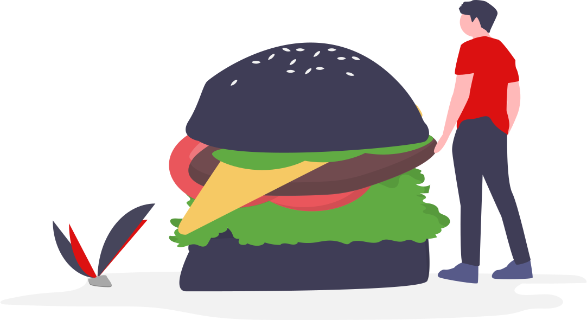

<meta charset="utf-8">
<h1 align="center">
    
</h1>
<h2 align="center">
  LasBurgers | Hamburgeria 
</h2>

## 🚀 Objetivo do Projeto

Projeto final da matéria de Lógica da Programação, com objetivo de criar um sistema de driveThru, com pedidos, pagamento, fila e modulo entrega.

## 🔖 DeadLine

- [X] Fim do projeto - 25/10/2020

Participantes do Projeto

 

 <strong>
    <a href="https://github.com/Deividev365">Deivid Almeida</a>,
    <a href="https://github.com/MARCOSVINICIUSDEOLIVEIRASOUZA">Marcos Vinicius</a>
 </strong>
 
